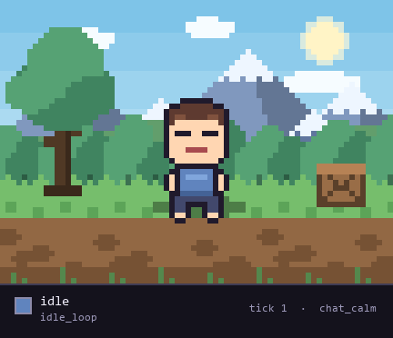

<p align="center">
  
</p>

<p align="center">
  <b>Four tiny language models. One pixel character. One question that turned out to be harder than the animation: when a model explains its decision, is the explanation true?</b>
</p>

<p align="center">
  
  
  
  <a href="https://github.com/VaibhavKarsh/PixelSwarm/actions/workflows/tests.yml"></a>
</p>

<p align="center">
  
</p>

---

## The moment it's built around

The character is mid-celebration when a danger event fires. Three models each decide one
thing, and a fourth gets to veto them:

```text
tick 3   chat hype spike    excited / celebrate
                            arbiter: approve

tick 4   danger event       alert / look_around  proposed
                            arbiter: REJECT   "look_around is disallowed after celebrate"
                                              ^ REAL RULE, honoured
                            committed         idle_loop        <- one neutral beat

tick 5   danger continues   alert / look_around  proposed
                            arbiter: REJECT   "look_around disallowed after idle_loop
                                               in alert mood"
                                              ^ NO SUCH RULE, overruled by the validator
                            committed         look_around      <- scanning starts
```

Nobody wrote that pause into the animation. You cannot cut straight from a celebration into
a wary scan without it looking broken, so the arbiter refused and the character held a
neutral pose for exactly one tick.

Then look at tick 5. The arbiter refuses again, this time citing a rule about `idle_loop`
that does not exist anywhere in its rulebook. Deterministic code catches that and commits
the move anyway.

Both reasons are quoted verbatim from [`demo/trace_canonical.jsonl`](demo/trace_canonical.jsonl).
The first refusal cited a rule that exists. Most of the arbiter's refusals did not.

## The finding

```text
     51 / 71                72%                 24 / 24              6, 9, 8

  legal moves that     of the arbiter's     invented vetoes      the same config,
  were vetoed          vetoes named a       caught by the        measured three
  anyway               rule that does       validator, none      separate times
                       not exist            got through
```

The arbiter was rejecting legal moves and justifying it with rules that were not in the
rulebook it had been handed. Every acceptance test passed the whole time, because a wrong
rejection falls back to a neutral pose that is also legal.

That is the point of the project: **an output can be valid while the justification behind
it is invented, and a test suite that only checks outputs cannot tell the difference.**

## How it works

```text
              event  +  committed state
                          │
                          ▼
                   mood-picker            proposes a mood
                          │
                          ▼
                  action-picker           sees the mood, proposes a pose
                          │
                          ▼
                  dialogue-line           sees both, usually says nothing
                          │
                          ▼
               transition-checker         approves, or vetoes with a reason
                          │
                          ▼
             deterministic validator      enforces the rulebook both ways
                          │
                          ▼
              committed state  +  one line of JSON
```

| | Decides | Example |
|---|---|---|
| mood-picker | how the character feels | `alert` |
| action-picker | what its body does | `look_around` |
| dialogue-line | whether it says anything | *(usually nothing)* |
| transition-checker | approve all three, or veto | *"can't scan straight out of a celebration"* |

The arbiter holds a short list of moves that cannot follow each other, and it can reject
what the other three came up with. Behind it sits ordinary code enforcing that same list in
both directions: it will not let a banned move through, and it will not accept a veto that
is not actually in the list.

The short version of the architecture is that **the models propose, the code enforces, and
the log exposes the gap between them.**

Every tick writes one line of JSON: the triggering event, all three proposals with the
justification each model gave, the verdict, what was committed, per-call timings, and any
failures. Each record carries a fingerprint of the configuration that produced it, with a
sidecar naming the model, the hash of every prompt, and both config files.

## Try it

```bash
pip install -r requirements.txt
python -m swarm.harness
```

Python 3.13, no virtual environment needed, nothing to configure. That second command
replays the whole scene with every model swapped for a deterministic stand-in, so it needs
no model at all and finishes instantly:

```text
  tick  3  chat_hype_spike  -> excited  celebrate
  tick  4  game_danger      -> alert    idle_loop    "What was that?"  <-REJECT
  tick  5  game_danger      -> alert    look_around
```

To run it against real local models instead:

```bash
python -m swarm.harness --real all
```

That one needs [Ollama](https://ollama.com) running with the model pulled
(`ollama pull ornith:9b`). If it cannot reach a model it says so plainly instead of
pretending everything is fine.

## What it costs to run

Measured over 70 runs, all four personas on one local model:

| | |
|---|---|
| Model | `ornith:9b`, digest `a75697c14589`, 5.6 GB |
| Per tick | about 28 seconds, four sequential calls |
| Per full run | about 280 seconds, ranging 234 to 406 |
| Test suite | a few seconds, no model involved |

The four calls are sequential by design, since each one reads what the previous decided, so
this architecture offers little to parallelise. Correctness is treated as worth more than
speed here, which is only a defensible trade because nothing in this project is interactive.

## What I found

Four things came out of chasing that first number, and none of them are about pixel art.

1. An answer can be valid while the justification behind it is invented. In 51 of its 71
   rejections the arbiter blocked a move the rulebook actually permits, and 50 of those 51
   named a rule as the reason, so the rule they cited was not one they had been given.
   Finding that meant checking the model's stated reasons against the rulebook itself,
   which is not something most test suites do.

2. Model judgment needs constraining in both directions. There was already code stopping
   the model committing an illegal move. Nothing stopped it blocking a legal one for a
   made-up reason, and that asymmetry is exactly why the failure was quiet rather than
   loud. Enforcing the rulebook both ways took the character from being stuck in two poses
   to using its full range.

3. Ten runs will not tell you what you think they tell you. Three separate ten-run samples
   of one unchanged configuration scored 6, 9 and 8. Telling 85% apart from 75% here would
   need roughly 250 runs per arm, about 19 hours of compute. Plenty of confident
   before-and-after numbers for prompt changes are inside that noise.

4. A specification that cannot be executed will drift from the code. The mood and action
   enums, all four prompts, and the demo event table live in the documents and are parsed
   by the test suite, so editing a prompt without editing the doc fails a check.

## What happened when I measured it

The arbiter was making things up. It would write things like *"wave isn't allowed when the
mood is excited"* when nothing of the sort was written down anywhere.

None of my tests could see this. When a veto is wrong the character falls back to a safe
neutral pose—which is legal—so every check still passed. I only found it because I stopped
testing what I had written down and started asking whether the reasons in the log were
true.

Half of it was my own fault. The rulebook was a list of bans, and I never told the model
that anything not on the list is allowed, so it pattern-matched the shape of a rulebook and
invented plausible entries. Saying that one sentence out loud fixed a good chunk of it, and
undid a conclusion I had written down weeks earlier as a dead end.

The rest is handled in code now: a veto that cannot cite a real rule does not stand. Runs
passing every check went from 23 of 30 without that guard to 19 of 20 with it. The honest
way to put it is the other number though: 24 of 24 invented vetoes were caught and none got
through. Twenty runs cannot establish the gap between 77% and 95%, but the count of vetoes
caught is not an estimate.

I nearly reported all of this far too confidently. I had published "85% reliable" as though
it were a precise number, then ran the identical setup three more times and got 6, 9 and 8
out of 10. Same code, same afternoon. So the numbers here carry their uncertainty now, and
where something really matters I check a mechanism I can verify rather than a percentage I
cannot.

[The full write-up](demo/WRITEUP.md) goes through all of it in order, including the parts I
got wrong. The measurement protocol, per-criterion tables, confidence intervals and
significance tests are in section 7 of
[`docs/02_ARCHITECTURE_HARNESS_SPEC.md`](docs/02_ARCHITECTURE_HARNESS_SPEC.md), which is
where every number above comes from.

## Scope

A deliberately small controlled study: six moods, six actions, five transition rules, two
scripted scenarios, one local 9B model. It is built to make failure observable, not to
claim generality.

There is no baseline against a hand-written state machine, because one would follow the
rulebook perfectly by construction and the interesting question was never whether it could.
What is measured here is how a model-driven controller fails and how much of that failure
an ordinary test suite misses.

Nothing here is a claim about what the models internally "think". The measurable thing is
narrower and more defensible: whether the justification a model wrote down is consistent
with the rulebook it was handed. Those came apart often, which is the whole finding.

The four-way split into mood, action, dialogue and arbiter is a design premise rather than
a result. I never ran the ablation that would show whether one model doing all four jobs
works as well.


## What's in here

The two worth opening first:

**[Watch the four-minute walkthrough](demo/pixel_swarm_explained.mp4)**, the animation with
the justification each model gave on screen beside it. Every word is quoted from the trace.

**[Read a complete run](demo/trace_canonical.jsonl)**, ten ticks of every proposal, verdict
and stated reason, including the two refusals quoted at the top of this page.

| | |
|---|---|
| [`demo/WRITEUP.md`](demo/WRITEUP.md) | The long version: what worked, and what I got wrong |
| [`docs/`](docs/) | The planning docs, kept as a build log rather than tidied up afterwards |

```text
swarm/             the tick loop, the four personas, the model client
pixel_world/       the renderer, which imports nothing from swarm/
compiler_adapter/  the boundary between them
config/            moods, actions, models, and the transition rulebook
events/            the scripted scenarios
scripts/           validators, the reliability report, the renderers
tests/             15 checks, run with tests/run_all.py
```

Every frame is drawn from the log rather than screen-recorded, so the video cannot drift
from what the system actually did. Every word on screen is quoted from the trace.

## Poking at it

```bash
python tests/run_all.py                      # 15 checks, 260 tests, no model needed
python -m swarm.harness --real mood          # run one model for real, fake the rest
python scripts/run_reliability_report.py     # score a batch of runs
python scripts/render_trace.py               # turn any run into a GIF
python scripts/render_logo.py                # even the logo is drawn by the renderer
```

The mood, action and dialogue rules live in plain JSON and Markdown. Change
`config/transitions.json` and the character behaves differently without touching any code.

## License

[MIT](LICENSE). Fork it and take whatever is useful.
